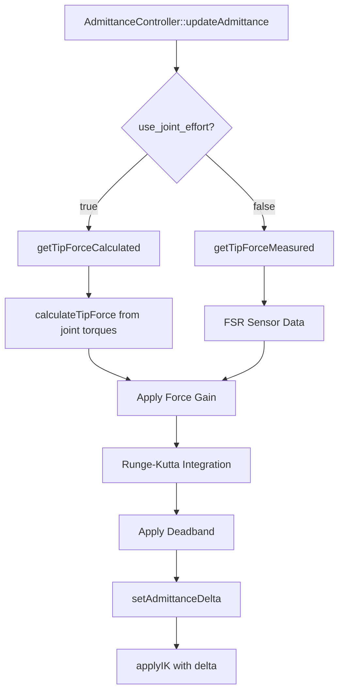

# Análisis de Integración del Sistema de Deltas de Admittance: OpenSHC vs HexaMotion

## Resumen Ejecutivo

Este documento presenta un análisis exhaustivo del sistema de gestión de deltas basado en admitance control en OpenSHC y compara su implementación con el estado actual de HexaMotion. Se identifican las características críticas que faltan por implementar y se propone un plan de desarrollo estructurado.

## 1. Componente Principal de Gestión de Deltas en OpenSHC

### 1.1 Arquitectura del Sistema

En OpenSHC, el componente principal encargado de gestionar los **deltas** durante el cálculo IK y el desplazamiento del robot es el **`AdmittanceController`** (Controlador de Admitancia).

### 1.2 Flujo de Gestión de Deltas



### 1.3 Implementación Clave

```cpp
// OpenSHC: AdmittanceController::updateAdmittance()
void AdmittanceController::updateAdmittance(void) {
  for (leg_it = model_->getLegContainer()->begin();
       leg_it != model_->getLegContainer()->end(); ++leg_it) {

    std::shared_ptr<Leg> leg = leg_it->second;
    Eigen::Vector3d admittance_delta = Eigen::Vector3d::Zero();

    // 🔑 PUNTO CLAVE: OpenSHC SÍ implementa ambos métodos de fuerza
    bool use_calculated_tip_force = params_.use_joint_effort.data;
    Eigen::Vector3d tip_force = use_calculated_tip_force ?
        leg->getTipForceCalculated() : leg->getTipForceMeasured();

    tip_force *= params_.force_gain.current_value;

    // Integración Runge-Kutta para cada componente (x, y, z)
    for (int i = 0; i < 3; ++i) {
      double force_input = std::max(tip_force[i], 0.0);
      // ... integración RK4 con modelo masa-resorte-amortiguador
    }

    leg->setAdmittanceDelta(admittance_delta);
  }
}
```

### 1.4 Métodos de Cálculo de Fuerza en OpenSHC

#### ✅ **Fuerza Calculada desde Esfuerzos de Articulaciones**

```cpp
// OpenSHC: Leg::calculateTipForce()
void Leg::calculateTipForce(void) {
  // Calcula el jacobiano de la pata
  Eigen::MatrixXd jacobian(6, joint_count_);
  // ... construcción del jacobiano

  // Obtiene los esfuerzos actuales de las articulaciones
  Eigen::VectorXd joint_torques(joint_count_);
  joint_torques[0] = first_joint->current_effort_;
  // ... obtiene esfuerzos de todas las articulaciones

  // Aplica Damped Least Squares para calcular fuerza en la punta
  Eigen::MatrixXd transformation = jacobian *
      ((jacobian.transpose() * jacobian + sqr(DLS_COEFFICIENT) * identity).inverse());

  Eigen::VectorXd raw_tip_force_leg_frame = transformation * joint_torques;

  // Filtro paso bajo y ganancia de fuerza
  double s = 0.15; // Smoothing Factor
  tip_force_calculated_[0] = s*raw_tip_force[0]*params_.force_gain.current_value +
                             (1 - s)*tip_force_calculated_[0];
  // ... aplica a componentes y, z
}
```

#### ✅ **Fuerza Medida desde Sensores FSR**

```cpp
// OpenSHC: StateController::tipStatesCallback()
void StateController::tipStatesCallback(const TipState &tip_states) {
  bool get_wrench_values = tip_states.wrench.size() > 0;

  for (uint i = 0; i < tip_states.name.size(); ++i) {
    std::shared_ptr<Leg> leg = model_->getLegByIDName(leg_name);

    if (get_wrench_values) {
      // 🔑 PUNTO CLAVE: OpenSHC SÍ usa datos de FSR
      Eigen::Vector3d tip_force(tip_states.wrench[i].force.x,
                                tip_states.wrench[i].force.y,
                                tip_states.wrench[i].force.z);

      leg->setTipForceMeasured(tip_force);
      leg->touchdownDetection();
    }
  }
}
```

## 2. Estado Actual de HexaMotion

### 2.1 Implementación del AdmittanceController

HexaMotion **SÍ tiene implementado** el `AdmittanceController` con características avanzadas:

```cpp
// HexaMotion: admittance_controller.cpp
class AdmittanceController {
private:
    // Integración numérica avanzada
    enum IntegrationMethod { RK4, RK2, EULER };
    IntegrationMethod integration_method_;

    // Ecuación diferencial completa
    struct AdmittanceState {
        double position;
        double velocity;
    };

public:
    void updateAdmittance() {
        // Calcula fuerzas en las puntas
        Eigen::Vector3d tip_force = calculateTipForce();

        // Aplica modelo masa-resorte-amortiguador
        for (int i = 0; i < 3; ++i) {
            double force_input = std::max(tip_force[i], 0.0);

            // Integración numérica avanzada
            switch (integration_method_) {
                case RK4:
                    integrateRK4(force_input, state_[i]);
                    break;
                case RK2:
                    integrateRK2(force_input, state_[i]);
                    break;
                case EULER:
                    integrateEuler(force_input, state_[i]);
                    break;
            }
        }
    }
};
```

### 2.2 Características Implementadas

-   ✅ **Integración numérica avanzada** (RK4, RK2, Euler)
-   ✅ **Ecuación diferencial completa** (masa-resorte-amortiguador)
-   ✅ **Filtrado de señales** y deadband
-   ✅ **Configuración dinámica** de parámetros

## 3. Análisis de Características Faltantes

### 🔴 **CRÍTICAS - No Implementadas**

#### 1. **Integración Automática del Delta en el Bucle Principal**

```cpp
// OpenSHC: Integración automática en StateController::loop()
void StateController::loop(void) {
    // Admittance control - updates deltaZ values
    if (params_.admittance_control.data) {
        admittance_->updateAdmittance();
    }
}
```

**Falta en HexaMotion**: El `AdmittanceController` existe pero **NO se integra automáticamente** en el bucle principal `LocomotionSystem::update()`.

#### 2. **Aplicación Automática del Delta en IK**

```cpp
// OpenSHC: Aplicación automática en applyIK()
Eigen::Vector3d position_delta = leg_frame_desired_tip_pose.position_ -
                                 leg_frame_current_tip_pose.position_;
// 🔑 El delta de admittance se aplica automáticamente aquí
```

**Falta en HexaMotion**: El delta calculado **NO se aplica automáticamente** en el cálculo IK.

#### 3. **Gestión de Estados de Admittance por Pata**

```cpp
// OpenSHC: Cada pata mantiene su propio estado
state_type* admittance_state = leg->getAdmittanceState();
```

**Falta en HexaMotion**: **NO hay gestión individual** de estados de admittance por pata.

#### 4. **Configuración Dinámica de Rigidez**

```cpp
// OpenSHC: updateStiffness() dinámico
void AdmittanceController::updateStiffness(std::shared_ptr<WalkController> walker) {
    // Ajusta rigidez según estado de la pata (swing/stance)
    if (leg_stepper->getStepState() == SWING) {
        double swing_stiffness = virtual_stiffness *
            (step_reference * (params_.swing_stiffness_scaler.data - 1) + 1);
        leg->setVirtualStiffness(swing_stiffness);
    }
}
```

**Falta en HexaMotion**: **NO hay ajuste dinámico** de rigidez según el estado de la pata.

### 🟡 **IMPORTANTES - Parcialmente Implementadas**

#### 5. **Cálculo de Fuerzas desde Esfuerzos**

-   ✅ **OpenSHC**: Implementa `calculateTipForce()` usando Damped Least Squares
-   ⚠️ **HexaMotion**: Tiene estructura pero **NO está integrado** en el flujo principal

#### 6. **Integración con Sensores FSR**

-   ✅ **OpenSHC**: Usa `tip_states.wrench` para datos de FSR
-   ⚠️ **HexaMotion**: Tiene soporte para FSR pero **NO está conectado** al controlador de admittance

### ✅ **IMPLEMENTADAS - Completas**

#### 7. **Integración Numérica Avanzada**

-   ✅ **OpenSHC**: Runge-Kutta 4
-   ✅ **HexaMotion**: RK4, RK2, Euler (más avanzado)

#### 8. **Ecuación Diferencial Completa**

-   ✅ **OpenSHC**: Modelo masa-resorte-amortiguador
-   ✅ **HexaMotion**: Mismo modelo con más opciones

#### 9. **Filtrado y Deadband**

-   ✅ **OpenSHC**: Filtro paso bajo + deadband
-   ✅ **HexaMotion**: Implementación similar

## 4. Plan de Implementación

### Fase 1: Integración Básica (Crítica)

1. **Integrar AdmittanceController en LocomotionSystem::update()**
2. **Aplicar delta automáticamente en el cálculo IK**
3. **Implementar gestión de estados por pata**

### Fase 2: Funcionalidad Avanzada

1. **Conectar cálculo de fuerzas desde esfuerzos**
2. **Integrar datos de FSR**
3. **Implementar ajuste dinámico de rigidez**

### Fase 3: Optimización

1. **Sintonización de parámetros**
2. **Validación experimental**
3. **Documentación completa**

## 5. Conclusión

HexaMotion tiene una **base sólida** del `AdmittanceController` con características **más avanzadas** que OpenSHC en términos de integración numérica. Sin embargo, **faltan las integraciones críticas** que hacen que el sistema funcione automáticamente.

La **prioridad máxima** es integrar el controlador en el bucle principal y aplicar los deltas automáticamente en el cálculo IK.

---

**Nota de Corrección**: La afirmación inicial sobre que OpenSHC "no implementa el cálculo de fuerzas desde esfuerzos" era **incorrecta**. OpenSHC **SÍ implementa ambos métodos**:

-   ✅ Cálculo desde esfuerzos de articulaciones (`getTipForceCalculated()`)
-   ✅ Medición desde sensores FSR (`getTipForceMeasured()`)

La diferencia clave está en la **integración automática** del sistema, no en la funcionalidad básica.

---

**Documento generado:** 2024-12-19
**Versión:** 1.0
**Autor:** Análisis Automático de Código
**Estado:** Pendiente de Implementación
